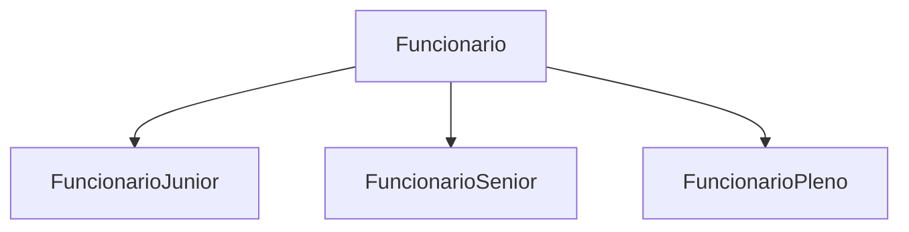

# DOCUMENTAÇÃO CP1 - JAVA

Este projeto tem como objetivo desenvolver um sistema em **Java** para gerenciar funcionários, aplicando conceitos de **orientação a objetos**, **herança**, **sobrescrita de métodos** e **anotações personalizadas**. Além disso, o projeto implementa a geração automática de código SQL utilizando **Reflection** e **Hibernate** para integração com um banco de dados **Oracle**.
## Nome Integrantes

| Nome | RM |
| ------------- |:-------------:|
| Arthur Eduardo Luna Pulini|554848|
|Lucas Almeida Fernandes de Moraes| 557569     |
|Victor Nascimento Cosme|558856|

## Informações
Antes de realmente começarmos, preciso passar algumas informações. Ao criarmos a classe `Funcionario`, também criamos o **`SequenceGenerator`** com o **`sequenceName = "SQ_FUNCIONARIO"`**. Caso essa sequência já exista no banco Oracle, podem ocorrer alguns erros durante os testes, especificamente nas operações de **`ViewDAODelete`**, **`ViewDAOBuscarPorID`** e **`ViewDAOAtualizar`**.

Para evitar esses erros, recomendo que altere o nome da sequência para algo como **`SQ_FUNCIONARIO_XTL`**. Com isso, uma nova sequência será gerada e os erros serão evitados.
## 🚀 Começando
Como solicitado fizemos a classe `Funcionario`, ele é uma `abstract`, as anotações que utilizamos nela foram: 

A única diferença é que foi utilizada a anotação `@Inheritance(strategy = InheritanceType.JOINED)`, que serve para criar tabelas separadas no banco de dados quando uma classe é herdada por outra.

E seus atributos estão assim:

Seguindo como solicidado dois métodos:

A herança de classe está assim: 

Os métodos `calcularSalario` e `imprimirInformacao` têm poucas diferenças entre si. No método `calcularSalario`, a alteração está na porcentagem de ganho a cada 15 horas trabalhadas, enquanto no método `imprimirInformacao`, as mudanças se limitam a alguns prints.

## ⚙️ Executando os testes

Os testes foram realizados no pacote chamado `view`, e todas as classes tem algum tipo de teste, a seguir vou falar dos testes seguindo o *CRUD* *(Create, Read, Update e Delete)*.

### ViewDAOCadastro

O começo é igual para todas as Views, como pode ver, criamos três funcionários, um de cada classe. Em seguida, instanciamos a `EntityManagerFactory`, depois criamos o `EntityManager` e chamamos a `FuncionarioDAOImpl`, que é responsável pela operação de _Create_.

Ao rodarmos o código, ele irá aparecer algumas informações, com a criação da _anotation_ @Tabela, ela irá printar isso:

Mas a Hibernate fornece outra saída:

## ViewDAOBuscarPorID

Como falado anteriormente os IDs estão bem diferente pois fizemos varios testes para chegarmos nessa solução, mas quando finalizar vou deixar os IDs como 1,2,3.. 
como se fosse a primeira vez rodando.

Ela chama a função `imprimirInformacao`, que retorna as informações do Funcionario já com o salário atualizado.

Com o @Tabela ela imprime assim: 

Com o Hibernate:

Ele faz um join, por causa do `@Inheritance(strategy = InheritanceType.JOINED)` que colocamos na classe pai.

E junto com essa saída ele imprime as informações do funcionario:

Vou fazer só com um funcionario porque se não vai ficar muito grande.

## ViewDAOAtualizar

Com o @Tabela:

Com o Hibernate:

## ViewDAODelete

Com o @Tabela:

Com o Hibernate:

